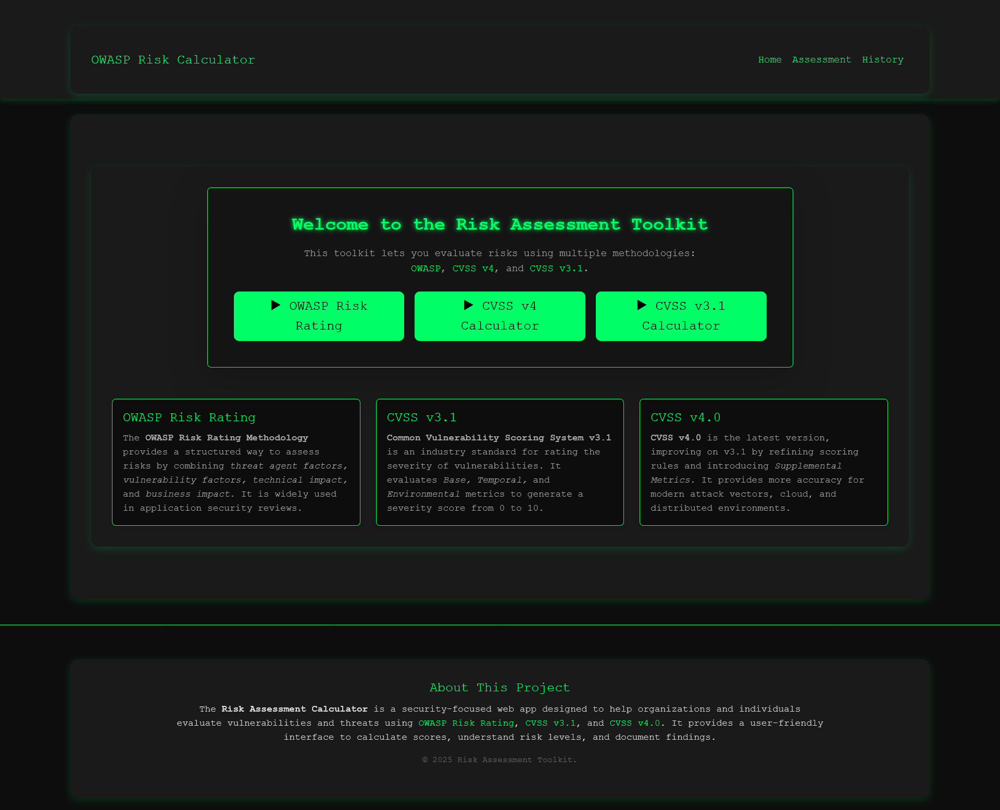

# 🛡️ Risk Assessment Toolkit  

A web-based toolkit to calculate and analyze security risks using **OWASP Risk Rating**, **CVSS v4.0**, and **CVSS v3.1** methodologies.  
This project helps security professionals, students, and developers understand risk scoring and assess vulnerabilities with ease.  

---

## 🚀 Features  
- **OWASP Risk Rating Calculator** – Evaluate risks based on threat agents, vulnerability factors, technical impact, and business impact.  
- **CVSS v4.0 Calculator** – Calculate severity scores using the official CVSS v4.0 scoring logic.  
- **CVSS v3.1 Calculator** – Legacy support for CVSS v3.1 scoring methodology.  
- **Results & Reports** – Save assessments and generate results for future reference.  
- **History Tracking** – View and compare past assessments.  
- **Dark Theme UI** – Hacker-style green-on-black theme for better readability and aesthetics.  

---

## 🖼️ Screenshots  
### Home Page  
  

### OWASP Calculator  
  

### CVSS3.1 Calculator  
  

### CVSS4.0 Calculator  
  

### Results Page  
  

### History Page  
  


---

## ⚙️ Tech Stack  
- **Frontend:** React.js, React Router, React Bootstrap  
- **Styling:** Custom dark theme with Bootstrap  
- **Logic:**  
  - CVSS v4.0 official scoring logic  
  - CVSS v3.1 calculation functions  
  - OWASP risk rating methodology  

---

## 🛠️ Installation & Setup  

1. **Clone the repository**  
   ```bash
   git clone https://github.com/GreenThenics/Risk-Assessment-Calculator.git
   cd Risk-Assessment-Calculator
2. **Install dependencies**
   npm install

3. **Start the development server**
   npm start

4. Open in browser → http://localhost:3000

---

## 👨‍💻 About the Project

This project was created as part of a cybersecurity learning journey to better understand risk assessment methodologies.
It is designed for students, researchers, and professionals who want a hands-on tool to practice risk calculations.
